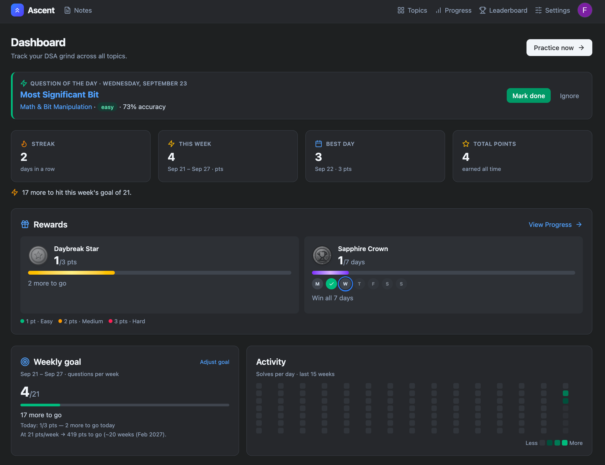

<div align="center">

# ⛰️ Ascent

**A gamified DSA practice tracker** — solve 250 curated problems, earn coins, climb ranks, and race friends on the leaderboard.

[](https://react.dev)
[](https://vitejs.dev)
[](https://tailwindcss.com)
[](https://firebase.google.com)
[](https://github.com/amit9838/ascent)
[](https://amit9838.github.io/ascent/)



</div>

---

## Features

- **Topic-wise practice** — 250 problems across 14 topics (Arrays → DP → Graphs), sourced from the [workat.tech index](https://workat.tech/problem-solving/practice/topics/index.html) with LeetCode/GeeksforGeeks equivalents
- **Progress tracking** — one-click solve toggle, per-topic progress bars, points weighted by difficulty
- **Gamification** — daily targets, weekly goals, Daybreak Stars & Sapphire Crowns, a rank ladder from *First Light* to *Crown Jewel*, streak & consistency titles
- **Notes** — up to 10 private plain-text notes (12k characters each), one storage record per note, collapsible list, debounce autosave
- **Leaderboard & social** — invite friends by email, accept/reject connections, live rankings, public profile sharing (you choose what's shared)
- **Cloud sync (optional)** — Firebase Auth (Google + email) with Firestore merge-based sync; runs **100% local/offline** when unconfigured
- **Local-first storage** — IndexedDB, dark mode, import/export JSON backups

## Quick start

```bash
git clone https://github.com/amit9838/ascent.git
cd ascent
npm install
npm run dev        # http://localhost:5173
```

Cloud features are optional — the app works fully offline out of the box.

### Enable cloud sync & leaderboard

1. Create a Firebase project, add a **Web app**, copy the config into `.env.local` (see [`.env.example`](./.env.example))
2. Enable **Google** and **Email/Password** sign-in providers
3. Publish [`firestore.rules`](./firestore.rules) (must match your project ID)
4. Optional local dev against emulators:

```bash
npx firebase-tools emulators:start --only auth,firestore
# .env.local → VITE_USE_EMULATORS=1
```

> Firebase web config values are public by design — real protection comes from Security Rules + Auth authorized domains.

## Scripts

| Command | Description |
| --- | --- |
| `npm run dev` | Start dev server |
| `npm run build` | Production build → `dist/` |
| `npm run preview` | Preview production build |
| `npm run deploy` | Build + publish to GitHub Pages |

## Project structure

```
src/
├── components/     # UI: header, auth menu, profile, coins, icons
├── pages/          # Home, Topics, Progress, Notes, Leaderboard, Settings, Profile
├── data/           # Topic list + CSV problem sets
├── lib/            # storage (IndexedDB), rewards, titles, activity
│   └── cloud/      # Firebase sync, merge strategies, connections
└── App.jsx         # Hash routes (gh-pages-friendly)
```

---

<div align="center">

Built with React · Vite · Tailwind CSS · Firebase

</div>
